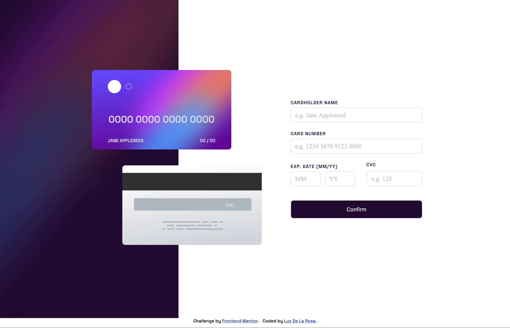

# Frontend Mentor - Interactive card details form solution

## Welcome! 👋
## Table of contents

- [Overview](#overview)
  - [Challenge](#the-challenge)
  - [Screenshot](#screenshot)
  - [Links](#links)
- [My process](#my-process)
  - [Built with](#built-with)
- [Author](#author)

## Overview
This is a solution to the [Interactive card details form challenge on Frontend Mentor](https://www.frontendmentor.io/challenges/interactive-card-details-form-XpS8cKZDWw). Frontend Mentor challenges help you improve your coding skills by building realistic projects. 
### Challenge
The challenge is to build out this Interactive card details form and get it looking as close to the design as possible.

Users should be able to:
- Fill in the form and see the card details update in real-time
- Receive error messages when the form is submitted if:
  - Any input field is empty
  - The card number, expiry date, or CVC fields are in the wrong format
- View the optimal layout depending on their device's screen size
- See hover, active, and focus states for interactive elements on the page

### Screenshot

This is a screenshot of my solution for the Interactive card details form coding challenge . 

### Links

- Solution URL: [Add solution URL here](https://github.com/luztherose/interactive-card-details-form-solution)
- Live Site URL: [Add live site URL here](https://github.com/luztherose/interactive-card-details-form-solution/)

## My process

### Built with

- Semantic HTML5 markup
- CSS custom properties
- Flexbox
- Sass/scss
- Mobile-first workflow
- Fully responsive
## Author

- Website - [Luz De La Rosa](https://luztherose.github.io/portfolio/)
- Frontend Mentor - [@luztherose](https://www.frontendmentor.io/profile/luztherose)
- Twitter - [@luztherose](https://twitter.com/luztherose)

**Have fun building!** 🚀